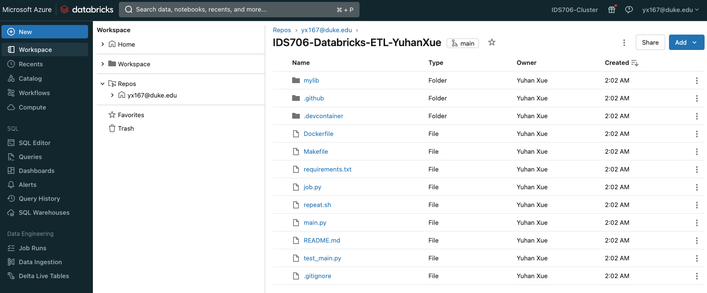
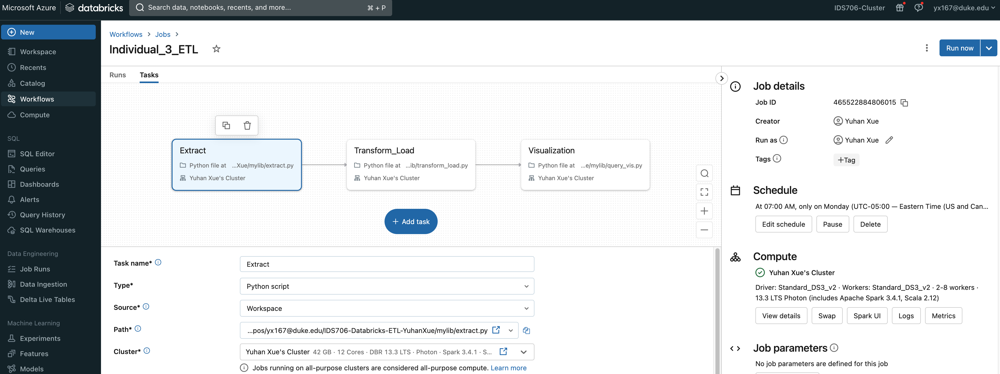
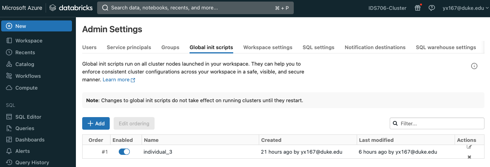
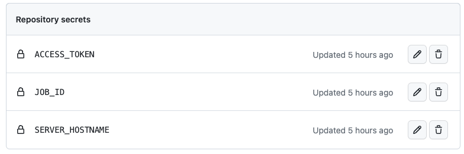
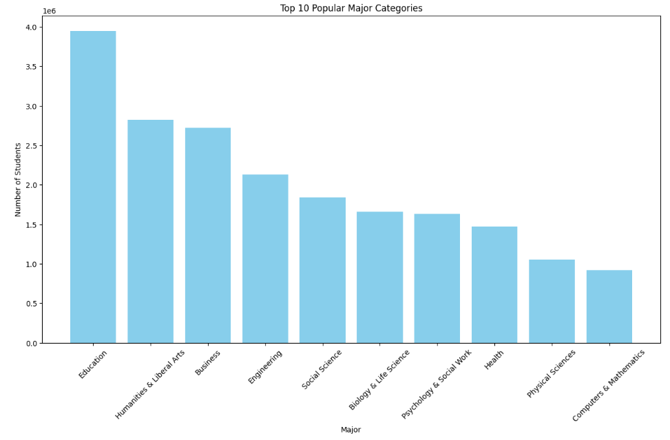
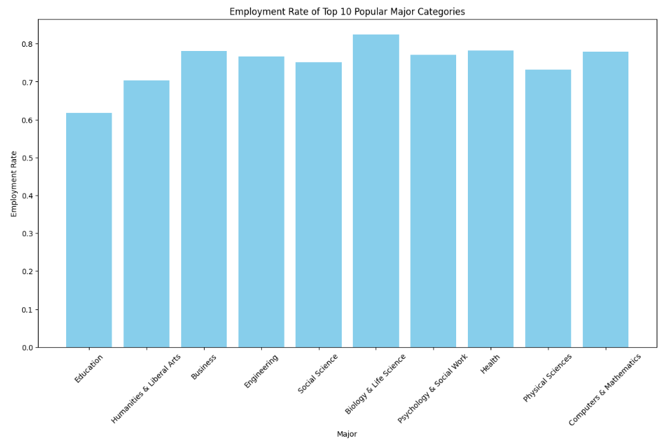

# IDS706-Databricks-ETL-YuhanXue

This repository contains the source codes for individual project 3.

## Introduction
The following two datasets are used:
1. [Major List](https://github.com/fivethirtyeight/data/blob/master/college-majors/majors-list.csv). This table contains a list of majors and their corresponding categories.
2. [Students](https://github.com/fivethirtyeight/data/blob/master/college-majors/grad-students.csv). This table contains statistics of the graduated students from each major (e.g. employment rate, median of salaries, etc.). 

In this project, I build a Databrick ETL pipeline to analyze the most popular majors (with largest number of graduates) and show their employment rate. 

## Key Files
1. `mylib/extract.py`: extract the data from its original source and store it in DBFS using csv format.
2. `mylib/transform_load.py`: parse the csv files into queryable tables and store them in Delta Lake.
3. `mylib/query_vis.py`: perform analytical queries on the tables in Delta Lake and visualize the results.
4. `job.py`: trigger the workflow pipeline that is set up in Databricks.
5. `main.py`: process data on the remote and visualize analytical results.

## Setup
1. Clone Github within the Databricks workspace.

2. Create job (workflow) based on `extract.py`, `transform_load.py` and `query_vis.py`.

3. Set up global environment variables (`SERVER_HOSTNAME`, `ACCESS_TOKEN`, `JOB_ID`).

4. Set up the same global environment variables in Github Action.

## Data Visualization
Top 10 popular major category (most number of students):

Employment rate:

## Video Demo
The following video demonstrates how the entire ETL process works:
[link](link).

## Resources
[https://hypercodelab.com/docs/spark/databricks-platform/global-env-variables/](https://hypercodelab.com/docs/spark/databricks-platform/global-env-variables/)

[https://learn.microsoft.com/en-us/azure/databricks/delta/](https://learn.microsoft.com/en-us/azure/databricks/delta/)

[https://docs.databricks.com/en/dbfs/filestore.html](https://docs.databricks.com/en/dbfs/filestore.html)
